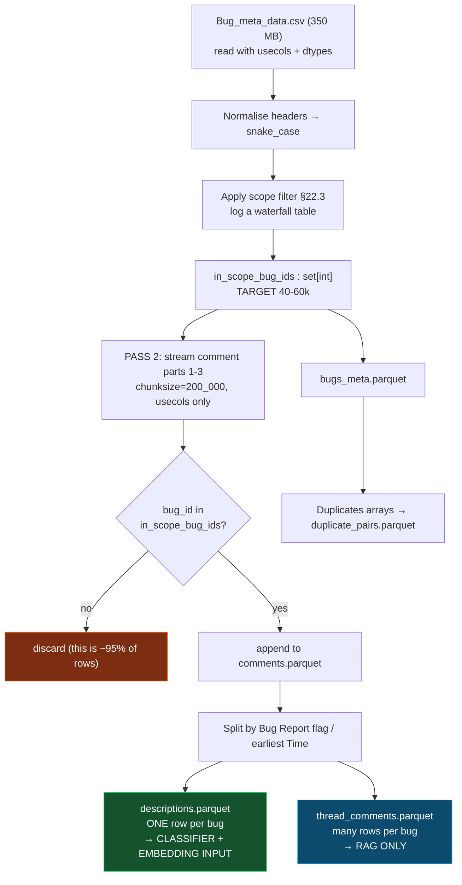

# BugsRepo — Critical Dataset Analysis for This Project

**Companion to [PROJECT_ROADMAP.md](PROJECT_ROADMAP.md) · Analysis date: 11 Aug 2026 · Status: pre-implementation**

---

## §0 How this analysis was produced

I did not rely on the abstract or on secondary summaries. Four primary sources were consulted:

| # | Source | What it settled |
|---|---|---|
| **S1** | **`0_Dataset_Info.pdf`** — the dataset's own data dictionary, downloaded from the Zenodo record and text-extracted | **The complete column list for all three datasets.** This is the authoritative field reference and it is *not* reproduced in the paper |
| **S2** | [arXiv:2504.18806 (HTML)](https://arxiv.org/html/2504.18806v1) — the EASE 2025 data paper | Collection methodology, **filtering criteria**, date range, counts, limitations |
| **S3** | [github.com/GindeLab/EASE_2025_Data_paper](https://github.com/GindeLab/EASE_2025_Data_paper) — the collection scripts | That data was pulled from the **Bugzilla REST API** with no `include_fields` restriction, i.e. full bug objects |
| **S4** | [zenodo.org/records/15004067](https://zenodo.org/records/15004067) | Exact filenames, sizes, licence |

**Important:** the paper's Table 3 (bug metadata) and Table 4 (contributors) are **genuinely truncated in the published paper** — they end in "..". Anyone analysing this dataset from the paper alone will have an incomplete field list. The data dictionary PDF is the source you need, and I have reproduced it in full in §2.

### Confidence marking used throughout

| Mark | Meaning |
|---|---|
| ✅ **VERIFIED** | Stated explicitly in a primary source, cited |
| 🔶 **INFERRED** | Follows logically from a verified fact; high confidence but not stated |
| ❓ **UNKNOWN** | Cannot be determined without loading the files. Every one of these appears in the Day-1 checklist (§23) |

**No number in this document is estimated or invented.** Where I don't know, I say ❓.

---

## §1 What files are actually provided?

✅ **VERIFIED** — Zenodo record 15004067, 15 files, 4.3 GB total.

| # | Filename (verbatim) | Size | What it is | Do you need it? |
|---|---|---|---|---|
| 1 | `0_Dataset_Info.pdf.pdf` | 263.3 kB | **The data dictionary.** Read this first | ✅ **Yes — first** |
| 2 | `Bug_meta_data.csv` | 350.2 MB | Bug metadata, CSV | ✅ **Yes — core** |
| 3 | `Bug_meta_data_230k_all.csv` | 350.2 MB | Bug metadata, "230k all" | ⚠️ **Investigate — see §1.1** |
| 4 | `Bug_meta_data_230k_excel.xlsx` | 75.5 MB | Same as #3 as Excel | ❌ No |
| 5 | `comments_Dataset_Part_1.csv` | 1.6 GB | Comments, part 1 | ✅ **Yes — this is the RAG corpus** |
| 6 | `comments_Dataset_Part_2.csv` | 1.6 GB | Comments, part 2 | ✅ Yes |
| 7 | `comments_Dataset_Part_3.csv` | 36.3 MB | Comments, part 3 | ✅ Yes |
| 8 | `CSV_Contribution_information_dataset.csv` | 7.4 MB | 19,351 contributors | ⚠️ Only for the optional developer-recommendation feature |
| 9 | `Contribution_information_dataset.xlsx` | 4.3 MB | Same as #8 as Excel | ❌ No |
| 10 | `CSV_100k_filtered_bug_reports.csv` | 152.0 MB | A filtered bug-report subset | ❓ Overlaps #2 — see §1.1 |
| 11 | `100k_filtered_raw_bug_reports.xlsx` | 34.3 MB | Same as #10 as Excel | ❌ No |
| 12 | `CSV_Bug_reports_with_steps_to_reproduce (1).csv` | 57.3 MB | Reports containing S2R / actual / expected behaviour | ✅ **Yes — high-value, small** |
| 13 | `Good_Bug_reports_with_S2r_AR_ER.xlsx` | 22.7 MB | The 10,351 structured subset | ⚠️ Optional (Excel form of #12's best rows) |
| 14 | `Good_CTQRS_filtered_bug_report.xlsx` | 2.8 MB | CTQRS-quality-filtered reports | ⚠️ Optional |
| 15 | `CTQRS_Scoring_Code.py` | 23.9 kB | The quality-scoring script | ❌ Not needed |

**Note the filename quirk:** file 1 is literally `0_Dataset_Info.pdf.pdf` (double extension) and file 12 contains a space and `(1)` — `CSV_Bug_reports_with_steps_to_reproduce (1).csv`. **URL-encode these when scripting the download**, or your download script will fail on the space.

### 1.1 Two unresolved file questions (Day-1 checklist items)

❓ **`Bug_meta_data.csv` vs `Bug_meta_data_230k_all.csv` are both exactly 350.2 MB.** Two readings:
- **(a)** They are the same content uploaded twice under different names.
- **(b)** They differ, and "230k" means ~230,000 rows — i.e. a **superset** of the 119,585 bugs the paper describes.

**Reading (b) would be very good news for you** (see §5), so this is worth five minutes: compare row counts and check whether `Resolution` takes values other than `FIXED` in the 230k file. This is the single highest-value verification in the whole checklist.

❓ **`CSV_100k_filtered_bug_reports.csv` (152 MB)** — "100k filtered" is close to the paper's 119,585. Likely the bug-report *text* corpus (summary + description) as opposed to `Bug_meta_data.csv`'s *metadata*. Check its header; if it contains the description text, it may let you skip joining the 3.2 GB comment files for the classification tasks (you would still need them for RAG).

---

## §2 What columns/fields are available?

✅ **VERIFIED — reproduced in full from `0_Dataset_Info.pdf`.** This is the complete list; the paper's version is truncated.

### 2.1 Bug Report Meta Data (48 columns)

| Column | Type | Description (as documented) |
|---|---|---|
| **Bug Id** | PK, Integer | Unique numeric ID of the bug |
| **Summary** | String | A brief description of the bug |
| **Priority** | String | Priority level (P1, P2, etc.) |
| **Severity** | String | Severity level (critical, major, minor) |
| Creator | String | Username/email of the bug creator |
| Creator Detail | Object | Detailed user information of the creator |
| Bug Status | String | Current status (NEW, IN PROGRESS, RESOLVED) |
| **Product** | String | Product associated with the bug |
| **Component** | String | The specific component/module where the bug was found |
| **Resolution** | String | Resolution state ('FIXED', 'INVALID') |
| Assigned To | String | Email/username of the assignee |
| Assigned To Detail | Object | Detailed user information for the assignee |
| Contributor Email | Array(String) | List of email addresses of contributors involved |
| Contributor Id | Array(Integer) | List of contributor IDs involved |
| Votes | Integer | Number of votes on the bug |
| QA Contact | String | QA contact person |
| QA Whiteboard | String | QA-related tracking notes |
| URL | String | A URL relevant to the bug report |
| Whiteboard | String | Additional notes about the bug |
| **Platform** | String | Hardware platform |
| **Operating System (op sys)** | String | OS on which the bug was found |
| **Version** | String | Product version where the bug was found |
| **Creation Time** | Datetime | Timestamp of bug creation |
| Last Change Time | Datetime | Timestamp of the last change |
| Is Open | Boolean | Whether the bug is currently open |
| Is Confirmed | Boolean | Whether the bug has been confirmed |
| Is CC Accessible | Boolean | Whether the CC list can access the bug |
| Is Creator Accessible | Boolean | Whether the creator can access the bug |
| **Type** | String | Type of bug ('defect', 'enhancement', etc.) |
| **Duplicate Of (`dupe_of`)** | Integer | **The bug ID of the bug that this bug is a duplicate of** |
| **Duplicates** | Array(Integer) | **List of bugs marked as duplicates of this bug** |
| Blocks | Array(Integer) | Bug IDs blocked by this bug |
| Depends On | Array(Integer) | Bug IDs this bug depends on |
| Regressions | Array(Integer) | Bugs introduced by this bug |
| Regressed By | Array(Integer) | Bugs that caused this bug |
| Comment Count | Integer | Number of comments on this bug |
| Flags | Array(Object) | Flags assigned to this bug |
| Keywords | Array(String) | Keywords associated with this bug |
| Classification | String | Classification category |
| Target Milestone | String | Milestone by which this bug should be fixed |
| Performance Impact | String | Performance-related impact |
| Status | String | Current status (NEW, CONFIRMED, RESOLVED) |
| Rank | Integer | Priority ranking of the bug |
| Rank in Product | Integer | Ranking of this bug in its product |
| Groups | Array(String) | Groups that can access this bug |
| A11y Review Project Flag | String | Accessibility review flag |
| Cab Review | String | Whether CAB review is required |
| Accessibility Review | String | Whether an accessibility review is required |

> Note `Bug Status` and `Status` both appear — 🔶 likely an artefact of the collection script storing the raw API `status` field alongside a renamed copy. Verify whether they are identical; if so drop one.

### 2.2 Bug Report Comments (8 columns)

| Column | Type | Description |
|---|---|---|
| **Comment Id** | PK, Integer | Unique identifier for the comment |
| **Bug Report** | Boolean | Indicates whether the comment is about a bug report |
| **Time** | Date | **Timestamp when the comment was posted** |
| **Creator** | String | Username/email of the comment's author |
| Author Id | Integer | Unique ID of the author |
| Tags | String | Tags associated with the comment |
| **Bug Id** | Integer | ID of the bug the comment belongs to |
| **Text** | String | The actual content of the comment |

**This resolves a conflict worth flagging.** The `Bug_comment.py` script in the GitHub repo writes only 4 columns (`Bug ID, Comment ID, Author, Comment Text`), **drops timestamps**, and **merges all follow-up comments into a single row** labelled `subsequent_comments`. If the released dataset had that structure, per-comment RAG chunking, recency ordering and bot filtering would all be impossible.

It does not. The data dictionary and the paper's Table 5 both describe **one row per comment with a `Time` field**, which matches the *MongoDB* collection path in the repo (which preserved all API fields), not the CSV path. ✅ **The released comments dataset supports the RAG design in the roadmap.** Confirm the header on Day 1 anyway — it costs one command and the whole RAG design rests on it.

### 2.3 Contributor Information (14 columns)

`Contributor Id` (PK), `User Name`, `Created On`, `Last Activity`, `Commented On`, `Permissions`, `Bugs Filed`, `Comments Made`, `Assigned To`, `Assigned To and Fixed`, `Patches Submitted`, `Patches Reviewed`, `QA Contact`, `Bugs Poked`.

❓ Column-name formatting (spaces vs underscores, casing) in the actual CSV headers is unverified — the PDF is prose-formatted. Normalise headers to `snake_case` on load rather than hard-coding names.

---

## §3 Which fields can be used for severity prediction?

✅ Available and sufficient.

| Role | Field | Notes |
|---|---|---|
| **Target** | `Severity` | ⚠️ Two label vocabularies — see §16.1 |
| **Input text** | `Summary` | From metadata |
| **Input text** | Description = comment where `Bug Report = True` | ⚠️ **From the comments dataset — you must join.** The metadata CSV has no description column |
| Input | `Product`, `Component`* | *Component only if you accept that in deployment a component is not yet known — see §19 |
| Input | `Platform`, `Operating System`, `Version`, `Type` | Available at submission time |
| Input | `Classification` | Static taxonomy over products; safe but largely redundant with `Product` |

> **The single most consequential practical finding in this analysis:** the description text lives **only** in the comments dataset. `Bug_meta_data.csv` gives you `Summary` (a one-line title) and nothing else textual. A project built on the metadata file alone would be a title-only classifier. **You must ingest and join the 3.2 GB comment files even for the classification tasks.** Budget for this in Week 2 — it is not just a RAG concern.

---

## §4 Which fields can be used for component classification?

✅ Available and well supported.

- **Target:** `Component` — ✅ present, and it is a required Bugzilla field so null rates should be near zero.
- **Scoping:** `Product` — the paper states >50 Mozilla projects with **Core, Firefox and Thunderbird** the largest. Component names are only meaningful *within* a product (`Core → Networking: HTTP` vs `Thunderbird → Message Reader`), so the label must be scoped or namespaced.
- **Inputs:** `Summary` + description, `Platform`, `Operating System`, `Version`, `Type`.

**Recommendation stands from the roadmap, now with better justification:** scope to **Core + Firefox**, use the **top 20 components + `Other`**. Alternatively, if verification shows the label space is manageable, use `Product::Component` as a namespaced label. Decide from your own `value_counts()`, not from this document.

---

## §5 Can it support duplicate / similar bug detection?

**This is where the dataset has a real problem, and also its own solution. Read this section carefully — it is the one place where the roadmap's plan has to change.**

### 5.1 The problem

✅ **VERIFIED (paper, §Data Collection):** the dataset was built by *"filtering… focusing on bugs with 'RESOLVED' or 'CLOSED' status and 'FIXED' resolution."* Only resolved-as-fixed bugs are included.

🔶 **Therefore: bugs whose resolution is `DUPLICATE` are excluded from the corpus.** A bug marked duplicate is not marked fixed.

**Consequences:**
1. `Duplicate Of (dupe_of)` will be **null or empty for essentially every row**, because a bug with a non-null `dupe_of` is by definition resolved `DUPLICATE`, not `FIXED`.
2. `Resolution` is effectively a **constant column** (`FIXED`) → useless as a feature and useless for distinguishing outcomes.
3. **The roadmap's §10.5 Path A and Path B are both dead.** There is no `resolution = DUPLICATE` population to mine, and no duplicate-marker boilerplate comment to regex, because those bugs aren't here.

Had I not checked the filtering criteria, this would have surfaced in Week 6 with two objectives unmeasurable and no time to fix it.

### 5.2 The solution, which is in the dataset already

✅ **VERIFIED (data dictionary):** the metadata contains

> **`Duplicates` — Array(Integer) — "List of bugs marked as duplicates of this bug."**

This is the *inverse* link, and it survives the filter. A FIXED bug that had five reports duplicated onto it carries those five bug IDs in its `Duplicates` array. **Duplicate pairs are recoverable** — you get `(duplicate_bug_id → canonical_fixed_bug_id)` for free, in the file you already downloaded.

The catch: the duplicate side's **text** is not in BugsRepo (those bugs were filtered out). Three ways to handle it, in preference order:

| Path | Method | Cost | Quality |
|---|---|---|---|
| **D1** | If `Bug_meta_data_230k_all.csv` turns out to be an unfiltered 230k superset containing `DUPLICATE`-resolution bugs (§1.1), both sides are already on disk | 5 min to check | **Best** — clean, self-contained, no external calls |
| **D2** | Take the duplicate bug IDs from the `Duplicates` arrays and fetch **only those bugs** from the Bugzilla REST API: `/rest/bug/{id}?include_fields=id,summary,creation_time,product,component` plus `/rest/bug/{id}/comment` for the description | ~2 calls per duplicate; a few thousand duplicates ≈ a few hours with polite rate limiting; cache to disk | **Very good**, and it is a genuinely strong engineering story: *"we recovered retrieval ground truth by resolving inverse duplicate links against the live tracker"* |
| **D3** | Fall back to **in-corpus curated link fields**: `Regressions`, `Regressed By`, `Blocks`, `Depends On` — human-established relationships between bugs where **both sides may be FIXED and therefore both in your corpus** | Zero external calls | Weaker as a *duplicate* label, but a legitimate **"related bug retrieval"** ground truth. Reframe the metric honestly as related-bug retrieval, not duplicate detection |

**Plus, regardless of path: hand-label ~100 query→relevant pairs yourselves.** A small gold set you constructed and can defend beats a large noisy one you can't.

### 5.3 What this means for your objectives

Objective O4 (Recall@10) and O5 (duplicate precision) from the roadmap **remain achievable**, via D1 or D2. But they now carry a **hard Day-2 dependency**: you must count how many non-empty `Duplicates` arrays exist before committing. If that count is under ~500, drop to D3 and rename the task.

**Do not skip this count.** It is one `value_counts()` on a column you already have.

---

## §6 Does it contain comments?

✅ **Yes — abundantly, and this is the dataset's decisive advantage for your project.**

- 3.24 GB across `comments_Dataset_Part_1/2/3.csv`.
- **One row per comment**, with `Comment Id`, `Bug Id`, `Time`, `Creator`, `Author Id`, `Tags`, `Text`, and a `Bug Report` boolean.
- ✅ The metadata's `Comment Count` column lets you sanity-check the join (sum of comment rows per bug should equal `Comment Count`).

❓ **Ambiguity to resolve on Day 1: what does `Bug Report` (Boolean) actually mean?** Two readings:
- **(a)** "this comment *is* the initial bug report" — i.e. comment 0, the description. The paper's prose supports this: it *"distinguish[es] the initial bug report from subsequent discussion comments."*
- **(b)** Something CTQRS-related — a flag for comments that constitute a well-formed report with steps to reproduce.

**Reading (a) is very likely** 🔶, but it determines how you extract descriptions. Two-minute check: for a handful of bug IDs, confirm that exactly one comment per bug has `Bug Report = True` and that it is the one with the minimum `Time`/`Comment Id`. If so, use it. If the flag is unreliable, fall back to *"the earliest comment by `Time` for each `Bug Id`"* — which is robust regardless.

---

## §7 Does it contain resolution information?

**Partially — and not in the way the word "resolution" suggests. This distinction matters for your project.**

| Sense of "resolution" | Available? | Detail |
|---|---|---|
| **Resolution *status*** (the field) | ⚠️ Present but **constant** | `Resolution` = `FIXED` for all rows (🔶 given the filter). Zero information as a feature. **Do not report "resolution distribution" as an EDA finding** — it is a single bar, and presenting it as a result would look naive |
| **Resolution *knowledge*** (how it was actually fixed) | ✅ **Yes, richly** | This lives in the **comment threads** — the developer discussion explaining root cause, the patch landing, the backout, the verification |
| Resolution *timestamp* | ⚠️ Proxy only | `cf_last_resolved` is **not** in the documented column list. `Last Change Time` is the available proxy for lifecycle duration — note it is an approximation, since post-resolution edits shift it |

**Reframe this as a strength, because it genuinely is one:** every bug in the corpus was actually fixed. Your RAG corpus contains no `INVALID`, no `WONTFIX`, no `WORKSFORME` — every thread you retrieve terminates in a real fix. For a *resolution recommendation* system this is close to ideal corpus composition. Say exactly that in your report.

---

## §8 Can historical bug reports and resolutions be used for RAG?

✅ **Yes — this is the strongest part of the dataset for your project.** All four requirements are met:

| Requirement | Status |
|---|---|
| Substantial natural-language text per bug | ✅ 3.24 GB of comments over 119,585 bugs |
| Text that explains *how things were fixed* | ✅ Every bug is FIXED; threads contain root-cause discussion, patches, backouts |
| Per-item timestamps (for temporal correctness) | ✅ `Time` on comments, `Creation Time` on bugs |
| Author identity (for bot filtering) | ✅ `Creator` + `Author Id` |
| Stable citation targets | ✅ `Bug Id` → `https://bugzilla.mozilla.org/show_bug.cgi?id=<id>` resolves to a real, public, verifiable page |

**Bonus asset:** `CSV_Bug_reports_with_steps_to_reproduce (1).csv` (57 MB) and the 10,351-report CTQRS-filtered subset give you high-quality structured reports with explicit steps-to-reproduce / actual / expected behaviour. Two good uses: (1) as demo inputs, since they are well-formed; (2) as a **quality-stratified evaluation slice** — "does the system perform better on well-structured reports?" is a real, cheap, interesting experiment.

⚠️ **The one RAG risk that remains unquantified:** ❓ how much of the comment volume is **automated bot traffic** (bugbot, autonag, treeherder/push notifications, backout notices). Mozilla threads carry a lot of it. This does not threaten feasibility — it threatens *corpus quality*, and the mitigation (author-based filtering) is already in the roadmap §18.5. **Measure it in Week 2, not Week 8.**

---

## §9 Does it contain enough information for evaluating our models?

| Component | Ground truth | Verdict |
|---|---|---|
| Severity classification | `Severity` labels | ✅ Yes — with the caveats in §16 and §17 |
| Component classification | `Component` labels | ✅ Yes — the cleanest of the three tasks |
| Similar/duplicate retrieval | `Duplicates` arrays (+ `Regressions`/`Blocks`/`Depends On`) | ⚠️ **Conditional on the §5.3 count** |
| RAG generation | None — no dataset provides this | ✅ Expected; you build a 60-item hand-labelled set (roadmap §21.5). No dataset has RAG ground truth; this is normal and you should say so rather than treat it as a gap |
| Chronological evaluation | `Creation Time` | ✅ Yes — supports the roadmap's chronological split |

---

## §10 Licence and usage restrictions

✅ **VERIFIED:** Zenodo record 15004067 is released under **Creative Commons Attribution 4.0 International (CC-BY 4.0)**.

| Permitted | Required | Note |
|---|---|---|
| Use, share, adapt, redistribute — including commercially | **Attribution** to the creators | Cite the EASE 2025 data paper *and* link the Zenodo record |
| Build and publish derived datasets and models | Indicate if changes were made | Your cleaned parquet files are a derivative — say so |
| Publish your repo publicly | — | |

**Practical compliance steps:**
1. Cite BugsRepo (paper + Zenodo DOI) in `README.md`, the app's **About page**, and the report's references.
2. State in `docs/DATASET.md` that you produced a filtered/derived subset and describe the filtering.
3. **Do not commit the raw files to Git** — link to Zenodo. This is good practice anyway (§11) and sidesteps redistribution questions.
4. ⚠️ **Separate concern — the underlying Bugzilla data.** BugsRepo's CC-BY licence covers their compilation. The source content is Mozilla's public bug tracker, and it contains **real contributor names and email addresses** (`Creator`, `Contributor Email`, `QA Contact`, `Assigned To`). Treat these as personal data: hash them at ingestion, never display raw emails, never send them to an LLM API. This is the roadmap §31.4 policy, and this dataset makes it non-optional rather than precautionary.
5. ⚠️ The **GitHub collection repo has no licence file** ❓. Don't reuse their scripts in your codebase without checking; you don't need them anyway.

---

## §11 Actual download sizes

| Set | Files | Size |
|---|---|---|
| **Minimum viable** (classification + retrieval, no RAG) | `0_Dataset_Info.pdf.pdf`, `Bug_meta_data.csv`, `comments_Dataset_Part_3.csv` | ~390 MB |
| **Recommended for your MVP** | + `comments_Dataset_Part_1.csv`, `comments_Dataset_Part_2.csv`, `CSV_Bug_reports_with_steps_to_reproduce (1).csv` | **≈ 3.65 GB** |
| + optional developer recommendation | + `CSV_Contribution_information_dataset.csv` | ≈ 3.66 GB |
| Everything | all 15 files | 4.3 GB |

**Skip all `.xlsx` files** — they are Excel duplicates of CSVs you already have, cost 139 MB, and are slower to parse.

**Disk budget:** raw ~3.7 GB + processed parquet ~0.3–0.6 GB + embeddings (60k × 384 float32 ≈ 92 MB) + Postgres volume ~1.5–2 GB. **Plan for 8 GB free.** On OneDrive-synced folders (your project path is under OneDrive) — ⚠️ **put `data/` outside OneDrive or mark it as excluded from sync.** Syncing 3.7 GB of raw CSV will hammer your bandwidth, may lock files mid-read, and OneDrive's file-on-demand placeholders cause confusing `FileNotFoundError`s in pandas. This is a real, common, and very annoying failure mode.

---

## §12 How should we download and preprocess it?

**Download:** direct HTTP from Zenodo, no registration. Pattern: `https://zenodo.org/records/15004067/files/<FILENAME>?download=1`, with the filename **URL-encoded** (file 12 contains a space and parentheses). Use `curl -L -C -` or `wget -c` so an interrupted 1.6 GB download resumes instead of restarting. **Record the SHA-256 of every file** and put the hashes in `docs/DATASET.md` — that is how you prove reproducibility, and how you detect a truncated download before it corrupts a week of work.

**Preprocess:** a strict two-pass, ID-driven design. Full plan in §22.

---

## §13 Which subset should two students use?

**Recommendation: `Product ∈ {Core, Firefox}`, defect-type bugs, top-20 components + `Other`, target 40,000–60,000 bugs.**

| Choice | Reason |
|---|---|
| Core + Firefox | ✅ Verified as the largest products; keeps vocabulary coherent; makes component labels meaningful. Adding Thunderbird brings a different domain (email) and a disjoint component space for no gain |
| Defect-type only (`Type = defect`) | Excludes tasks/enhancements. Note ✅ the authors already excluded `Severity = enhancement`, so this is a second, cleaner filter on a different field |
| Top-20 components + `Other` | A 200-class classifier trained by two students produces an uninterpretable confusion matrix |
| 40–60k bugs | Below ~20k, rare components have too few examples to evaluate. Above ~80k, your iteration loop slows for no scientific gain |
| **Full comment corpus for those bugs** | Do **not** subsample comments. They are the RAG corpus, and the retrieval-quality ceiling scales with it |

**Downsampling rule if you exceed 60k: stratify by year.** A flat random sample distorts the temporal distribution your chronological split depends on.

---

## §14 Data leakage risks

This dataset is **unusually leak-prone**, because the collection script pulled *complete* Bugzilla bug objects with no field restriction — so you have 48 columns, most of which describe the bug's **entire resolved lifecycle**. Every row is a fully-closed bug photographed at the end of its life, while your model must predict at the *beginning* of it.

**The governing test for every field:** *"Would this value be knowable at the instant a reporter clicks Submit?"*

Applying it to all 48 columns gives §18. Five leaks are severe enough to name here:

1. **`Comment Count`** — accumulates over the bug's life. A new bug has 0. Strongly correlated with severity. Classic.
2. **`Keywords`** — Mozilla keywords include `crash`, `regression`, `dataloss`, `hang`, `sec-critical`. These are **applied by triagers, often at the same moment severity is set**. Using them to predict severity is close to using the target. This one is dangerous precisely because it *looks* like an innocent text feature.
3. **`Contributor Email` / `Contributor Id` / `Votes`** — populate as people engage over time.
4. **`Assigned To`, `QA Contact`, `Target Milestone`, `Whiteboard`, `QA Whiteboard`, `Is Confirmed`, `Rank`** — all set during or after triage.
5. **`Duplicates` / `Blocks` / `Depends On` / `Regressions` / `Regressed By`** — curated relationship links established later. **`Duplicates` is your retrieval label — it must never also be a classifier feature.**

⚠️ **Subtler, dataset-specific leak: `Bug Report = True` comment text.** The description is the earliest comment, so it is safe. But **comments 1..n are not** — they contain the fix discussion. If you accidentally concatenate all comments as "the bug text", you will train a severity classifier on text that says *"landed the patch, this was a crash on startup"*. Your validation macro-F1 will look excellent and the model will be worthless. **Use only the `Bug Report`/earliest comment for classifier inputs; all comments are for RAG only.** These two paths must be separate code paths with separate variable names.

---

## §15 Are there duplicate records?

❓ Row-level duplication is unverified until you load, but there are **four specific mechanisms** to check, and each has a defined action:

| Mechanism | Check | Action |
|---|---|---|
| **Same file, two names** — `Bug_meta_data.csv` vs `Bug_meta_data_230k_all.csv` (identical 350.2 MB) | Row counts + hash | Use one; document which (§1.1) |
| **Overlap at comment-part boundaries** — a 3-way split of one export may repeat rows at the seams | `Comment Id` duplicated across parts | `drop_duplicates(subset=["Comment Id"])` after concatenating |
| **Repeated `Bug Id`** in metadata | `df["Bug Id"].duplicated().sum()` | `drop_duplicates(subset=["Bug Id"], keep="first")`. If large, your load is wrong — investigate, don't just drop |
| **Near-duplicate bug *text*** across the train/test boundary | MinHash or normalised-text hash | Remove from **training only**. Regression storms produce near-identical reports; if they straddle the split, your test score measures memorisation |

⚠️ **Terminology discipline:** "duplicate records" (rows to delete) and "duplicate bugs" (your ground-truth labels, to preserve) are different things and an examiner may test whether you conflate them. Use distinct names in code: `drop_duplicate_rows()` vs `duplicate_bug_pairs`.

---

## §16 Class imbalance problems

### 16.1 Severity — two problems stacked

🔶 **Problem 1: two label vocabularies in one column.** The dataset spans 2018→Oct 2024 and Mozilla replaced `blocker/critical/major/normal/minor/trivial` with `--/S1/S2/S3/S4` during that window ([Bugzilla bug 1628593](https://bugzilla.mozilla.org/show_bug.cgi?id=1628593), [Firefox Source Docs](https://firefox-source-docs.mozilla.org/bug-mgmt/guides/severity.html)). The data dictionary's description ("critical, major, minor") reflects the *legacy* vocabulary only — 🔶 **it does not mean the new values are absent**; it means the dictionary was written loosely. Expect both. `value_counts()` grouped by year will show the migration as a visible transition, and that chart belongs in your report.

⚠️ **Problem 2: `normal`/`S3` will dominate.** `normal` was Bugzilla's default value and most reporters never changed it. ❓ The exact ratio is unverified, but heavy skew is a documented property of Bugzilla severity data. Consequence: **macro-F1 is your headline metric and the majority-class baseline appears in every table** (roadmap §21.1).

**Also expect `--` (unset).** That is a *missing label*, not a class. Drop from severity training; keep the bug in the retrieval and RAG corpora.

### 16.2 Component — long tail

⚠️ Mozilla Core alone has well over a hundred components. The distribution will be heavy-tailed. Mitigations already planned: top-20 + `Other`, `class_weight="balanced"`, a ≥200-training-example floor per retained class, and reporting **Top-3 accuracy** alongside macro-F1 because the product use is routing suggestions.

### 16.3 A third imbalance nobody will mention unless you do

⚠️ **Selection bias from the FIXED-only filter.** Your corpus is not a sample of *bug reports*; it is a sample of *bugs that got fixed*. Fixed bugs skew toward higher severity, better-written reports, and more active components. Reports resolved `INVALID`/`WORKSFORME`/`INCOMPLETE` — which in production are a large share of the incoming stream and are exactly the low-quality inputs a triage tool must survive — are **entirely absent**.

**This belongs in your "threats to validity" section, stated plainly:** *"Our models are trained and evaluated on bugs that were eventually fixed. Performance on the full incoming stream, which includes invalid and unreproducible reports, is not measured by our evaluation and would likely be lower."* Volunteering this is a mark of rigour; being caught not knowing it is not.

---

## §17 Temporal leakage problems

✅ **The fields needed to prevent temporal leakage are all present** — `Creation Time` on bugs, `Time` on comments. Four distinct temporal leaks apply here:

| # | Leak | Mechanism | Prevention |
|---|---|---|---|
| **T1** | **Random train/test split** | Bug reports cluster; a regression produces near-identical reports in one week. A random split scatters them across train and test, and the model "predicts" by memorising | **Chronological split** on `Creation Time`: oldest 70% train / next 15% val / newest 15% test |
| **T2** | **Retrieving the future** | Evaluating a test-period query against an index containing bugs created *after* it | Store `Creation Time` on every vector; apply a max-date filter at evaluation time. **Build this filter as a parameter from day one** — retrofitting it in Week 11 while numbers are due is miserable |
| **T3** | **RAG evidence from the future** | Same problem, one layer up: retrieving a comment written after the query bug was filed | `Time` is on every comment — filter chunks the same way |
| **T4** | **The label-vocabulary migration coinciding with your split boundary** | If your 70/15/15 boundary lands near the severity migration, train and test may use *different label systems*, and your "concept drift" is really a schema change | Plot severity-by-year **before** choosing the boundary. If they collide, run the **era-restricted ablation** (train and test within the new vocabulary only) and report both |

**T4 is specific to this dataset and this time window.** It is the kind of finding that reads as genuine analysis rather than a checklist item.

---

## §18 Fields that must NOT be used as ML features

The complete 48-column verdict. 🚫 = forbidden, ⚠️ = conditional, ✅ = safe.

### 🚫 Forbidden — post-triage or post-resolution information

| Field | Why |
|---|---|
| `Resolution` | Terminal state. Also constant here → zero information anyway |
| `Status`, `Bug Status` | Terminal state; near-constant |
| `Is Open` | Constant (all closed) |
| `Is Confirmed` | Set during triage |
| `Comment Count` | Accumulates post-submission. **The classic leak** |
| `Contributor Email`, `Contributor Id` | Accumulate as people engage |
| `Votes` | Accumulates |
| `Assigned To`, `Assigned To Detail` | Assignment happens after triage |
| `QA Contact`, `QA Whiteboard` | Assigned during triage |
| `Whiteboard` | Triage annotations, often literally encoding priority decisions |
| `Target Milestone` | Set during planning |
| `Rank`, `Rank in Product` | Derived from priority |
| `Keywords` | ⚠️ **Highest-risk "innocent-looking" field.** Triager-applied, includes `crash`/`regression`/`dataloss` |
| `Flags` | Review/approval flags, all post-submission |
| `Performance Impact` | Triage assessment |
| `Cab Review`, `Accessibility Review`, `A11y Review Project Flag` | Triage decisions |
| `Last Change Time` | Post-resolution timestamp |
| `Duplicates`, `Duplicate Of`, `Blocks`, `Depends On`, `Regressions`, `Regressed By` | Curated later. **`Duplicates` is a label, never a feature** |
| `Groups` | Access-control state |
| **Comments where `Bug Report = False`** | **Contain the fix.** RAG-only (§14) |

### ⚠️ Conditional — defensible only with a stated argument

| Field | Condition |
|---|---|
| `Priority` | Often set at the same time as severity, sometimes by the same person. **Exclude from the primary severity model; report a "with-priority" ablation.** That contrast — offline benchmark vs deployable model — is worth explaining in the viva |
| `Component` as a *feature for severity* | Only honest if your product predicts severity *after* component is known. State the assumption; the roadmap's UI predicts both at submission, so **exclude it** and optionally use *predicted* component |
| `Creator` / reporter history | Legitimate **only** as an expanding-window statistic computed from strictly earlier bugs. Computing "reporter's bug count" over the whole dataset leaks the future into the past |
| `Version` | Safe as a categorical, but ⚠️ high-cardinality and drifts hard between eras (`64.0` never appears in the test period). Bucket it, or reduce to `version_is_specified` |
| `Is CC Accessible`, `Is Creator Accessible` | Almost certainly useless; include only if EDA shows a real effect |

### ✅ Safe — knowable at submission

`Summary` · description (the `Bug Report = True` / earliest comment) · `Product` · `Classification` · `Platform` · `Operating System` · `Type` · `URL` (presence only) · `Creation Time` (derived cyclical features only) · and all **derived text features**: title/description length, `has_stack_trace`, code-block count, crash-keyword flags computed **from the description text you control** (not from the `Keywords` field).

> Put this table in your report as the "leakage register". It demonstrates that you audited 48 columns rather than pasting whatever the CSV contained into a model — which is exactly the difference an examiner is looking for.

---

## §19 Exact fields per ML task

### Task 1 — Severity classification

| | |
|---|---|
| **Target** | `Severity` → normalised to `High` / `Medium` / `Low` (§21.4) |
| **Primary text** | `Summary` + description (`Bug Report = True` comment text) |
| **Categorical** | `Product`, `Platform`, `Operating System`, `Type`, `Classification` |
| **Derived numeric** | `title_len`, `desc_len`, `has_stack_trace`, `n_code_blocks`, `n_urls`, crash-keyword flags, `n_steps_to_reproduce`, `version_is_specified` |
| **Excluded (stated)** | `Priority` (ablation only), `Component`, `Keywords`, `Comment Count`, everything in §18 |

### Task 2 — Component classification

| | |
|---|---|
| **Target** | `Component`, scoped to Core+Firefox, top-20 + `Other` |
| **Primary text** | `Summary` + description |
| **Categorical** | `Product`, `Platform`, `Operating System`, `Type` |
| **Derived** | `has_stack_trace` (**strongest single signal** — a trace names the subsystem), `n_code_blocks` |
| **Excluded** | `Severity`, `Priority`, `Keywords`, everything in §18 |

### Task 3 — Similar / duplicate retrieval

| | |
|---|---|
| **Embedded text** | `Summary` + description |
| **Vector metadata** (filters, not dimensions) | `Bug Id`, `Product`, `Component`, `severity_norm`, `Creation Time`, `has_resolution_text`, `n_comments_retained` |
| **Ground truth** | `Duplicates` arrays (D1/D2), fallback `Regressions`/`Regressed By`/`Blocks`/`Depends On` (D3), plus ~100 hand-labelled pairs |
| **Duplicate scorer input** | cross-encoder score (+ optional `same_component`, `days_apart`) |

### Task 4 — RAG corpus

| | |
|---|---|
| **Documents** | All comments for in-scope bugs, bot- and boilerplate-filtered |
| **Per chunk** | `Bug Id`, `Comment Id`, `Time`, `Creator` (**hashed**), `source_type`, `Product`, `Component`, citation URL |
| **Excluded from prompts** | Raw emails, `Contributor Email`, any PII |

### Task 5 (Optional) — Developer recommendation

`Contribution_information_dataset` joined on contributor ID, filtered to recent activity, scored via retrieval similarity. Display **handles only**, framed as "suggested reviewers".

---

## §20 Can this dataset realistically support the complete MVP?

| MVP capability | Supported? | Evidence / condition |
|---|---|---|
| 1. Severity prediction | ✅ **Yes** | `Severity` + text. Requires vocabulary normalisation (§21.4) |
| 2. Component prediction | ✅ **Yes** | `Component` + text. The cleanest of the three tasks |
| 3. Similar / duplicate retrieval | ⚠️ **Yes, conditionally** | `Duplicates` arrays exist ✅, but the duplicate side's text needs D1 or D2. **Gate: ≥500 usable pairs** |
| 4. RAG knowledge base | ✅ **Yes — excellent** | 3.24 GB of timestamped, attributed comments on exclusively-fixed bugs |
| 5. Evidence-based recommendations | ✅ **Yes** | Threads + citable public URLs |
| 6. Web application | ✅ **Yes** | Dataset-independent |

**Four things the dataset does *not* give you, which you must supply:**
1. **Documentation corpus (K4)** — not in BugsRepo. Hand-collect ~40 pages (roadmap §19.3).
2. **Component glossary (K5)** — you write it. An afternoon; materially improves recommendation quality.
3. **RAG evaluation labels** — you hand-label 60 items. No dataset provides these.
4. **Duplicate-side bug text** — path D2, if D1 doesn't apply.

---

## §21 VERDICT

# **B — Suitable with modifications**

**Not A**, for three specific reasons, each with a defined fix:

| # | Issue | Severity | Fix |
|---|---|---|---|
| 1 | **FIXED-only filter removes all `DUPLICATE`-resolution bugs**, killing the obvious duplicate-detection ground truth | **High** — gates two objectives | Use the `Duplicates` inverse-link arrays (path D1/D2/D3, §5.2). **Verify the count on Day 2** |
| 2 | **Descriptions are not in the metadata file** — they live in the 3.2 GB comment corpus | **High** — changes your Week-2 plan | Mandatory two-pass ID-driven join (§22.2). Budget for it |
| 3 | **Two severity vocabularies + heavy skew + FIXED-only selection bias** | Medium | 3-class normalisation, macro-F1, era ablation, and an honest threats-to-validity paragraph |

**Not C — decisively not.** The reason to keep this dataset over every alternative is unchanged and, after this analysis, better evidenced: it is the only candidate that pairs severity and component labels with **119,585 timestamped, attributed developer discussion threads on exclusively-fixed bugs**. That corpus is what makes your RAG component substantive rather than decorative. The Lamkanfi MSR-2013 dataset has better duplicate coverage but no comparable thread corpus; DeepTriage has neither severity nor component labels. **Trading a rich RAG corpus for easier duplicate labels would be a bad trade**, because the duplicate labels are recoverable (§5.2) and the corpus is not.

**Two conditions on this verdict:**
1. **§23's Day-1/Day-2 checks must pass**, in particular the duplicate-pair count. If it comes in under ~500 and path D2 proves impractical, **rename the feature to "related bug retrieval"**, use path D3 plus your hand-labelled gold set, and adjust objectives O4/O5. That is a scope adjustment, not a project failure — but it must be decided in Week 1, not discovered in Week 6.
2. **The comment-corpus ingestion is on the critical path.** Treat it as a Week-2 deliverable with its own definition of done, not as a background task.

---

## §22 Concrete Dataset Preparation Plan

### 22.1 Stage 0 — Download

**Target layout** (⚠️ place `data/` **outside your OneDrive-synced tree**, or exclude it from sync — §11):

```
data/
├── raw/
│   ├── bugsrepo/
│   │   ├── 0_Dataset_Info.pdf.pdf
│   │   ├── Bug_meta_data.csv                              350.2 MB
│   │   ├── Bug_meta_data_230k_all.csv                     350.2 MB   [investigate first]
│   │   ├── comments_Dataset_Part_1.csv                    1.6 GB
│   │   ├── comments_Dataset_Part_2.csv                    1.6 GB
│   │   ├── comments_Dataset_Part_3.csv                    36.3 MB
│   │   ├── CSV_Bug_reports_with_steps_to_reproduce (1).csv 57.3 MB
│   │   ├── CSV_Contribution_information_dataset.csv       7.4 MB     [optional feature]
│   │   └── SHA256SUMS.txt
│   └── docs/                                              [you collect these — roadmap §19.3]
├── interim/
└── processed/
```

**Rules:**
- `https://zenodo.org/records/15004067/files/<URL-ENCODED-NAME>?download=1`
- **URL-encode filenames.** `CSV_Bug_reports_with_steps_to_reproduce (1).csv` → `%20` and `%28`/`%29`.
- Use resumable downloads (`curl -L -C -` / `wget -c`). A 1.6 GB transfer will fail at least once.
- Compute SHA-256 for every file → `SHA256SUMS.txt` → copy into `docs/DATASET.md`.
- **`data/raw/` is immutable.** Never edit, never write back, always gitignored.

**Deliverable:** files on disk, hashes recorded, ~3.65 GB.

### 22.2 Stage 1 — Two-pass, ID-driven ingestion (the core design)

**Never load a 1.6 GB comment CSV with a bare `pd.read_csv`.** The whole pipeline is organised around one idea: *decide which bug IDs you care about first, then stream everything else through that filter.*



**Non-negotiable rules:**
1. `usecols=` on **every** read. You need ~15 of 48 metadata columns and ~6 of 8 comment columns.
2. `chunksize=200_000` on the comment files; filter each chunk against the ID set; append to Parquet.
3. **Parquet everywhere downstream.** ~5–10× smaller, typed, ~20× faster to reload.
4. **`descriptions` and `thread_comments` are separate files with separate names.** This is the structural defence against the §14 leak — if they are separate artifacts, you cannot accidentally feed fix discussion to a classifier.
5. Log row counts at every stage. The waterfall table goes straight into your report.

**Prototype on `comments_Dataset_Part_3.csv` (36 MB) first.** Get the whole pipeline correct on the small part before spending 40 minutes streaming 3.2 GB.

**Deliverable:** `bugs_meta.parquet`, `descriptions.parquet`, `thread_comments.parquet`, `duplicate_pairs.parquet`, waterfall log.

### 22.3 Stage 2 — Cleaning and scope filtering

Apply **in this order**, logging the row count after each step:

| # | Filter | Expected effect |
|---|---|---|
| 1 | Normalise headers to `snake_case`; coerce dtypes; parse `creation_time` as UTC | — |
| 2 | `product ∈ {Core, Firefox}` | Large reduction |
| 3 | `type == "defect"` | Removes tasks/enhancements |
| 4 | `severity ∉ {enhancement, N/A}` | Second-line defence on a different field |
| 5 | Drop rows with null/blank `summary` | Small |
| 6 | Join `descriptions`; drop bugs with no description or `len(desc_clean) < 50` | ❓ measure this |
| 7 | `len(summary) ≥ 15` | Small |
| 8 | Component → top-20 + `Other`; drop retained classes with <200 training examples into `Other` | Sets label space |
| 9 | If >60k remain: **stratified-by-year** downsample to ~60k | — |

**Text cleaning** (identical function for training and serving — roadmap §11.10): strip HTML/entities; **preserve stack traces and code blocks** into a separate `code_text` field with a `has_stack_trace` flag; mask URLs→`<URL>`, `bug 12345`→`<BUGREF>`, review IDs→`<REVREF>`, emails→`<EMAIL>`, long hex/base64→`<BLOB>`; strip Bugzilla boilerplate (`User Agent:`, `Build Identifier:`) **after** extracting anything you need from it; normalise whitespace.

⚠️ **Do not strip stack traces.** They are the strongest component-prediction signal in the corpus, and removing them as "noise" is the most expensive preprocessing mistake available in this domain.

### 22.4 Stage 3 — Missing values

| Field | Policy | Reason |
|---|---|---|
| `summary` | Drop row | Primary signal |
| description | Drop row if <50 chars | Protects both classifier and retrieval quality |
| `component` | Drop row | It is a target; cannot impute |
| `severity` = `--`/null | **Drop from severity training; keep in retrieval + RAG corpora** | A missing label is not a class |
| `priority` | Impute `"unknown"` as an explicit category | "Never set" is itself informative — and it is an ablation-only feature anyway |
| `version` | Impute `"unspecified"` + derive `version_is_specified` | High cardinality; drifts across eras |
| `platform`, `op_sys` | Impute `"unspecified"` | |
| `resolution` | Keep, expect constant `FIXED` | Do not impute; do not use as a feature |
| Comment `text` empty | Drop comment | |
| Array columns (`duplicates`, `blocks`, …) | Empty list, not null | Parse defensively — ❓ serialisation format unknown (JSON vs Python-repr); write a parser that handles both |

**Produce a missingness table (field × null count × %) before and after.** It is a required report artifact and takes one line of pandas.

### 22.5 Stage 4 — Deduplication

1. **`Bug Id` duplicates** in metadata → `drop_duplicates(subset=["bug_id"], keep="first")`. If the count is large, your load is wrong — investigate before dropping.
2. **`Comment Id` duplicates** after concatenating the three parts → drop. Specifically check the seams between parts.
3. **Near-duplicate bug text** (normalised-text hash, or MinHash >0.95) → **remove from the training split only**, after splitting. Never from test.
4. **Preserve `duplicate_pairs.parquet` untouched.** Those are labels (§15).

### 22.6 Stage 5 — Label preparation

**Severity → 3 classes.** Profile `value_counts()` by year first; the data is the authority, this mapping is the plan:

| Raw | → |
|---|---|
| `blocker`, `critical`, `S1`, `major`, `S2` | **High** |
| `normal`, `S3` | **Medium** |
| `minor`, `trivial`, `S4` | **Low** |
| `enhancement`, `N/A` | **drop** |
| `--`, null | **drop from severity training**, keep elsewhere |

Mandatory checks: (a) severity-by-year chart confirming the migration boundary; (b) per-class counts; (c) majority-class rate recorded as your floor baseline; (d) **check whether the migration boundary collides with your split boundary** (§17, T4).

**Component:** top-20 by frequency within scope + `Other`; report coverage %; persist the map to `artifacts/vN/label_maps.json`; the API never re-derives it.

**Duplicate pairs:** explode `duplicates` arrays into `(duplicate_bug_id, canonical_bug_id)` rows; record how many have text available on both sides; **this count is your go/no-go for O4/O5**.

### 22.7 Stage 6 — Train/validation/test split

**Chronological on `creation_time`: oldest 70% train / next 15% validation / newest 15% test.** Split **once**, persist `split` as a column, record boundary dates in `manifest.json`.

Rationale (memorise — it is a top-3 interview question): it matches deployment (train on past, predict future); it prevents the clustered-report leak (T1); and it exposes drift instead of hiding it. **Expect lower numbers than random-split papers, and say so in the report.**

Then: **the test set is opened exactly once, in Week 11.** Everything before that is tuned on validation. Report per-split class distributions — if they differ, that is a finding to discuss, not a bug to fix.

### 22.8 Stage 7 — Leakage prevention (concrete controls, not intentions)

| Control | Implementation |
|---|---|
| **Column allowlist** | Define `SAFE_FEATURE_COLUMNS` in `ml/config.py` from §18's ✅ list. The feature builder reads **only** from it and raises on anything else. Makes leakage a code error, not a review oversight |
| **Separate description / thread artifacts** | §22.2 rule 4 — structurally prevents fix-discussion text reaching a classifier |
| **Split before fit** | Vectorisers and scalers fitted inside a `Pipeline`, on train only |
| **Resample train only** | `class_weight="balanced"`; never touch val/test |
| **Temporal filter parameter** | `max_created_at` accepted by retrieval and RAG from day one, not retrofitted |
| **Expanding-window history features** | If you use reporter statistics, compute from strictly earlier bugs only |
| **Leakage register in the report** | The §18 table, with the "knowable at Submit?" test stated |
| **Automated guard test** | A unit test asserting the fitted feature names ∩ forbidden set is empty. Fails CI if someone adds `keywords` in Week 9 |

### 22.9 Stage 8 — RAG corpus creation

**Source:** `thread_comments.parquet` (never `descriptions.parquet` alone).

1. **Bot filtering** — build the author list empirically from `value_counts()` on `creator`; automation accounts are obvious by volume. **Log human-comment retention; this is the §12.3 red-flag check and it belongs in Week 2.**
2. **Boilerplate removal** — changeset-push notices, "Created attachment", backout templates with no prose.
3. **Length filter** — drop comments <40 chars.
4. **Resolution-bearing scoring** — score for `fix, fixed, caused by, root cause, regression, patch, landed, workaround, the problem is, backed out, reverted`; keep the top 3 per bug, tie-broken by **later `Time`** (later comments sit closer to the fix).
5. **Always retain the last substantive comment** — on a FIXED bug it is very often the fix explanation.
6. **Chunking on existing semantic boundaries:** one chunk per bug report; one chunk per comment; split only comments >1500 chars (1000-token windows, 100-token overlap). Do **not** impose fixed 512-token windows on documents that already have structure.
7. **Metadata per chunk:** `chunk_id, source_type, bug_id, comment_id, time, author_hash, product, component, url, token_estimate`.
8. **PII:** hash `creator`; ensure `<EMAIL>` masking ran **before** any text can reach an LLM prompt.
9. **Add K4 documentation (~40 pages) and K5 (your 21-entry component glossary)** — neither is in BugsRepo.

**Quality gates before building the pipeline (roadmap §19.5):** ≥60% of in-scope bugs retain ≥1 human comment; median retained comment ≥150 chars; **hand-read 20 random retained comments** and confirm they are about fixing the bug.

### 22.10 Stage 9 — Embedding generation

| Decision | Value |
|---|---|
| Model | `sentence-transformers/all-MiniLM-L6-v2` (384-d, CPU ~1–3 ms/doc) |
| Input | `"{summary}. {summary}. {description[:1500]}"` — title repeated as cheap up-weighting; **validate as an ablation** |
| Normalisation | L2-normalise; cosine similarity |
| Batch | 64–128; expect ~5–15 min for 60k on CPU |
| Cache | `data/processed/embeddings.npy` keyed by `bug_id` — you will need these dozens of times |
| **Stored with every vector** | `model_name` ⚠️ **mandatory.** Change encoder without it and you will silently mix two incompatible vector spaces |
| RAG chunks | Same encoder, same normalisation, separate table |

### 22.11 Stage 10 — Vector database preparation

**pgvector inside the PostgreSQL you already run** (roadmap §0.2). Order matters:

1. `CREATE EXTENSION IF NOT EXISTS vector;` **before** any migration referencing `vector(384)`.
2. Load relational rows first (`bugs`, `bug_comments`, `documents`, `doc_chunks`) via `COPY`/`execute_values`, batched 5k. Row-by-row `INSERT` on 60k rows with embeddings is the difference between minutes and an hour.
3. Insert vectors batched 1k.
4. **Build HNSW indexes last** — after bulk load, never before:
   ```sql
   CREATE INDEX ON bug_embeddings USING hnsw (embedding vector_cosine_ops)
     WITH (m = 16, ef_construction = 64);
   ```
5. `ANALYZE`.
6. B-tree indexes on `component`, `severity_norm`, `created_at`, `split` — needed for filtered and temporal retrieval.
7. Make seeding **idempotent** (`ON CONFLICT DO NOTHING`); you will run it many times.
8. Assert at API startup that the configured encoder matches `model_name` in the vector table.

---

## §23 Day-1 / Day-2 Verification Checklist

Every ❓ in this document, in priority order. **All of these are cheap. None should be deferred.**

### Priority 1 — decides the plan

- [ ] **Is `Bug_meta_data_230k_all.csv` different from `Bug_meta_data.csv`?** Compare row counts and file hashes. If it has ~230k rows, check `resolution.value_counts()` — **if `DUPLICATE` appears, you have both sides of every duplicate pair on disk and path D1 applies** (§5.2)
- [ ] **How many bugs have a non-empty `duplicates` array?** After the scope filter. **≥500 ⇒ O4/O5 proceed as planned; <500 ⇒ switch to path D3 and rename the task**
- [ ] **Confirm the comments CSV header** has `Time`, `Comment Id`, `Creator`, `Text`, `Bug Report` — i.e. one row per comment, not the merged `subsequent_comments` structure from the GitHub script (§2.2)
- [ ] **What does `Bug Report = True` select?** For 10 sample bugs, confirm exactly one True per bug and that it is the earliest by `Time`. If unreliable, use earliest-comment-by-`Time` instead (§6)

### Priority 2 — shapes preprocessing

- [ ] `severity.value_counts()` overall **and grouped by year** — confirm both vocabularies, locate the migration boundary, measure the skew
- [ ] `resolution.value_counts()` — confirm it is constant `FIXED` (and if not, that is good news)
- [ ] `product.value_counts()`, then `component.value_counts()` within Core+Firefox — set K, compute coverage %
- [ ] Row counts after each §22.3 filter — the waterfall table
- [ ] `creation_time` min/max; proposed 70/15/15 boundary dates; **does the boundary collide with the severity migration?** (§17 T4)
- [ ] Null rates for all retained columns
- [ ] Serialisation format of array columns (`duplicates`, `blocks`, `keywords`) — JSON? Python repr? Write a defensive parser
- [ ] Are `Status` and `Bug Status` identical? Drop one
- [ ] Does `CSV_100k_filtered_bug_reports.csv` contain description text? If so it may shortcut the classifier path (§1.1)

### Priority 3 — decides RAG corpus quality

- [ ] `creator.value_counts()` on a comment sample — identify bot accounts by volume
- [ ] **What fraction of comments survive bot + boilerplate + length filtering?** The §12.3 red-flag check
- [ ] Median retained comment length; comments-per-bug distribution
- [ ] Does `sum(comment rows per bug)` reconcile with metadata `comment_count`?
- [ ] `Comment Id` overlap across the three comment parts
- [ ] **Hand-read 20 random retained comments** — are they actually about fixing bugs?

### Priority 4 — housekeeping

- [ ] SHA-256 of every downloaded file → `docs/DATASET.md`
- [ ] `data/` excluded from OneDrive sync (§11)
- [ ] Free disk ≥8 GB
- [ ] CC-BY attribution added to README + About page + report

**Write every answer into `docs/DATASET.md` as you go.** By end of Week 1 that file is your dataset section, already written, with numbers you generated yourself.

---

## §24 Summary of changes to PROJECT_ROADMAP.md

| Roadmap section | Change |
|---|---|
| §0.1 verification table | `dupe_of` resolved: **present as a column but empty in practice**; `Duplicates` (inverse links) is the usable label source. Description confirmed **absent from metadata**, present in comments |
| §9.4 scope filter | Rule 3 (`resolution ∈ {FIXED, DUPLICATE, …}`) is **void** — resolution is constant. Replaced by `type == defect` |
| §10.5 duplicate paths | **Paths A and B are dead.** Replaced by D1/D2/D3 (§5.2 here) |
| §12.1 chart 7 | "Resolution distribution" is a single bar — **replace** with "duplicate-cluster size distribution" |
| §11.2 / §22.4 | `resolution` no longer a meaningful field; array-column parsing added |
| §16.3 leakage register | **Expanded from 7 fields to a full 48-column audit** (§18 here). `Keywords` added as a high-risk leak |
| §19 RAG corpus | Confirmed viable; comment `Time` field confirmed present, so recency ordering and temporal filtering work as designed |
| §21 objectives | O4/O5 now carry an explicit Week-1 feasibility gate |
| §27 Week 2 | Comment-corpus ingestion promoted to a **critical-path deliverable** — descriptions depend on it |
| New | Selection-bias (FIXED-only) threat to validity — §16.3 here |

---

*Analysis complete. No ML training code written. Next action: §23 Priority-1 checks, before any modelling decision is finalised.*
